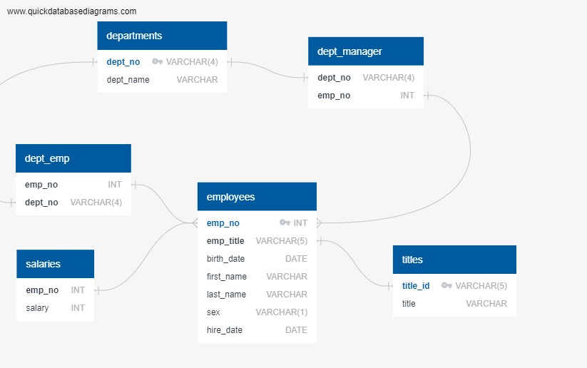

# EmployeeSQL
Background
It’s been two weeks since you were hired as a new data engineer at Pewlett Hackard (a fictional company). Your first major task is to do a research project about people whom the company employed during the 1980s and 1990s. All that remains of the employee database from that period are six CSV files.

For this project, you’ll design the tables to hold the data from the CSV files, import the CSV files into a SQL database, and then answer questions about the data. That is, you’ll perform data modeling, data engineering, and data analysis, respectively.

--Data Modeling--
Utilizing the six CSV files, I made an Entity Relationship Diagram (ERD) for Pewlett Hackard's company.  [See below]

--Data Engineering--
Using the ERD I then created a table schema for each of the six CSV files.  I specified the Data Types, Primary Keys, and Foreign keys.  Each Table was created so that the following tables would be able to utilize the Primary Keys as Foreign Keys.

--Data Analysis--
There were multiple questions that was tasked with answering.  Each of these questions were saved as a 'Views' in my database EmployeeSQL for Pewlett Hackard.

List the employee number, last name, first name, sex, and salary of each employee.
View : employee_data

List the first name, last name, and hire date for the employees who were hired in 1986.
View : employee_hire_1986

List the manager of each department along with their department number, department name, employee number, last name, and first name.
View : department_manager_data

List the department number for each employee along with that employee’s employee number, last name, first name, and department name.
View : department_employee_data

List first name, last name, and sex of each employee whose first name is Hercules and whose last name begins with the letter B.
View : EmployeeName_data

List each employee in the Sales department, including their employee number, last name, and first name.
View : Sales_Department_employees

List each employee in the Sales and Development departments, including their employee number, last name, first name, and department name.
View : Sales_Development_employees

List the frequency counts, in descending order, of all the employee last names (that is, how many employees share each last name).
View : frequency_employee_lastnames